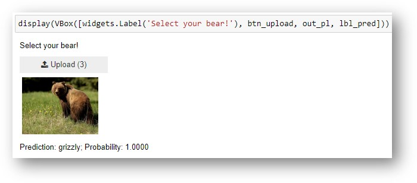

# Bear Classification App

The model has been trained by fine-tune a ResNet34 architecture into images of grizzle, black and teddy bears downloaded using the [duck duck go](https://duckduckgo.com/) search tool. The training has been done on [google colab](https://colab.research.google.com/) platform.

The app was built within jupyter notebooks by using the [voila](https://voila.readthedocs.io/en/stable/using.html) library.

---

### Technologies

1. [fastai](https://www.fast.ai/)
2. [PyTorch](https://pytorch.org/)
2. [voila](https://voila.readthedocs.io/en/stable/using.html)

### Setup

1. Install Anaconda
2. Create a conda environment: `conda create -n fastai python=3.8`
3. Activate the conda environment: `conda activate fastai`
4. Install [PyTorch](https://pytorch.org/get-started/locally/) via pip
5. Install [fastai](https://www.fast.ai/): `pip install fastai`
6. Install jupyter: `pip install jupyter`
7. Install voila: `pip install voila`
8. Enable voila jupyter extension: `jupyter serverextension enable --sys-prefix voila`

### References

1. [Chapter 02 of the fastbook](https://github.com/fastai/fastbook/blob/master/02_production.ipynb)
2. [`bear_classification.ipynb` github repo](https://github.com/fastai/bear_voila)
3. [About `NotImplementedError: cannot instantiate ‘PosixPath’ on your system`](https://forums.fast.ai/t/lesson-3-load-data-fails/43726)

